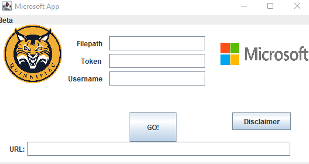

# Setup

[Home](./)

In order to use this prototype, you must first download two Java packages that are added to the project.

### [GitSubprocessClient](https://github.com/CSC109/GitSubprocessClient) & [GitHubApiClient](https://github.com/CSC109/GitHubApiClient)

The packages (.jar files) can be downloaded from their repos under the **Releases** section (make sure to grab the most up to date version).
Then, in your respective files, add the two Java packages to the code from the repo. This will allow all files to work, meaning the prototype will run.

Once ran, you will see the following window.

The user is prompted to type multiple inputs, and all must be filled out, other than the URL.

The user must input the filepath of their project they'd like to create a repo for.

This will then be followed by inputting their **token**.
It's important to note that in order to use the tool, the user will need to generate a personal GitHub API token.

This can be created in five steps.

#### 1. Verify your email to GitHub, if it has not been verified yet.

#### 2. Click your profile photo, then "settings".

#### 3. In the sidebar, click "Developer Settings"

#### 4. Click "Personal Access Tokens"

#### 5. Follow the steps to generate the token, and input it into our prototype.

Lastly, you'll need to input your GitHub username, so that we can complete the repo.

**After that, the program will give you a URL to a newly created Repo!**
